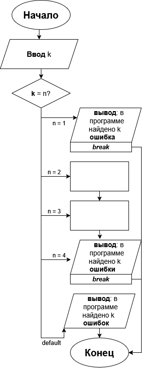

# Домашнее задание к работе 7

## Условие задачи
Для натурального числа k (k < 20) напечатать фразу «в программе найдено k ошибок», согласовав окончание слова «ошибка» с числом k. Использовать конструкцию if-else недопустимо. (Вариант 14)

## 1. Алгоритм и блок-схема

### Алгоритм
1. **Начало**
2. Ввести натуральное число **k** (k < 20).
3. Определить окончание слова «ошибка» по значению **k** с помощью оператора switch:
   - **k = 1** — слово «ошибка»;
   - **k = 2, k = 3 или k = 4** — слово «ошибки»;
   - **все остальные значения (ветвь default)**, в том числе 11–14, — слово «ошибок».
4. Вывести фразу «в программе найдено k ...» с выбранным окончанием.
5. **Конец**

### Блок-схема


## 2. Реализация программы

```c
#define _CRT_SECURE_NO_DEPRECATE

#include <stdio.h>
#include <stdlib.h>

int main() {
    int k;

    system("chcp 65001 > nul");

    puts("Введите натуральное число k (k < 20)");
    scanf("%d", &k);

    switch (k)
    {
        case 1:
            printf("в программе найдено %d ошибка\n", k);
            break;
        case 2:
        case 3:
        case 4:
            printf("в программе найдено %d ошибки\n", k);
            break;
        default:
            printf("в программе найдено %d ошибок\n", k);
    }

    system("pause");
    return 0;
}
```

## 3. Результаты работы программы

Запуск с **k = 1** — единственное значение, при котором согласуется слово «ошибка»:

```
Введите натуральное число k (k < 20)
1
в программе найдено 1 ошибка
```

Запуск с **k = 3** — слово «ошибки» (для чисел 2, 3 и 4):

```
Введите натуральное число k (k < 20)
3
в программе найдено 3 ошибки
```

Запуск с **k = 5** — слово «ошибок»:

```
Введите натуральное число k (k < 20)
5
в программе найдено 5 ошибок
```

Запуск с **k = 12** — число попадает в ветвь default, поэтому окончание «ошибок» (так же для 11, 13 и 14):

```
Введите натуральное число k (k < 20)
12
в программе найдено 12 ошибок
```

Запуск с **k = 19** — наибольшее допустимое значение:

```
Введите натуральное число k (k < 20)
19
в программе найдено 19 ошибок
```

## 4. Информация о разработчике
Сбоев Даниил, бОТИ-261
